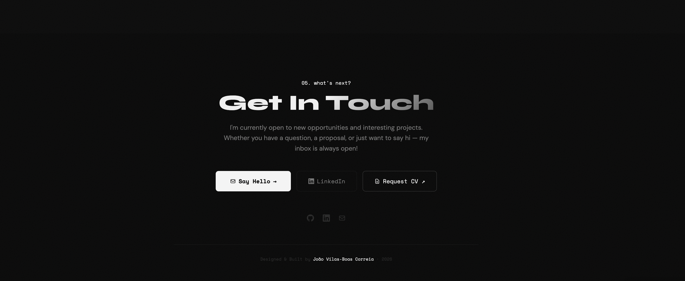

# João Vilas-Boas Correia — Portfolio

Personal portfolio website — a snapshot of my journey as a Full Stack Developer. Built to show who I am, what I've built, and where I've worked.

**Live:** [jovbcorreia.com](https://www.jovbcorreia.com)

---

## Screenshots

<table>
  <tr>
    <td><strong>Hero</strong><br/></td>
    <td><strong>About Me</strong><br/></td>
  </tr>
  <tr>
    <td><strong>Skills</strong><br/></td>
    <td><strong>Projects</strong><br/></td>
  </tr>
  <tr>
    <td><strong>Experience</strong><br/></td>
    <td><strong>Contact</strong><br/></td>
  </tr>
</table>

---

## About

This is my personal portfolio — it covers my professional background, the companies I've worked at (EBSCO, Deloitte), the technologies I use daily, and a selection of projects I've built.

The design is dark, terminal-inspired, and intentionally minimal. The focus is on the content, not the decoration.

---

## Features

- Terminal-inspired dark design with smooth animations
- Typewriter effect on the hero section
- Animated skill progress bars (Frontend, Backend, Database, DevOps)
- Fully responsive on all screen sizes
- SEO-optimised with Next.js metadata
- Sections: Hero · About · Skills · Projects · Experience · Contact

---

## Tech Stack

### Framework & Language
- **Next.js 14** (App Router)
- **TypeScript**
- **React**

### Styling & UI
- **Tailwind CSS**
- **CSS Animations**
- **react-intersection-observer** (scroll-triggered animations)

### Fonts
- **Syne** — headings
- **DM Sans** — body text
- **Space Mono** — terminal / code blocks (Google Fonts)

### Hosting & Infrastructure
- **Cloudflare** — DNS, CDN, DDoS protection
- **Vercel** — CI/CD and deployment (auto-deploys on push to `main`)
- **Node.js 18+** — runtime
- **GitHub** — version control and source of truth

---

## Getting Started Locally

### Prerequisites
- Node.js 18+
- npm or yarn

### Install & Run

```bash
npm install
npm run dev
```

Open [http://localhost:3000](http://localhost:3000).

### Build

```bash
npm run build
npm start
```

---

## Project Structure

```
portfolio/
├── src/
│   ├── app/
│   │   ├── layout.tsx        # Root layout + metadata
│   │   ├── page.tsx          # Main page (assembles all sections)
│   │   └── globals.css       # Global styles + CSS variables
│   ├── components/
│   │   ├── Navbar.tsx        # Navigation bar
│   │   ├── Hero.tsx          # Hero with typewriter effect
│   │   ├── About.tsx         # About me + terminal card
│   │   ├── Skills.tsx        # Tech skills with progress bars
│   │   ├── Projects.tsx      # Projects grid
│   │   ├── Experience.tsx    # Work experience timeline
│   │   └── Contact.tsx       # Contact section + footer
│   └── lib/
│       └── data.ts           # All personal data in one place
├── screenshots/              # Portfolio screenshots
├── public/                   # Static assets
├── tailwind.config.js
├── next.config.js
└── package.json
```

---

## Customisation

All personal data lives in **`src/lib/data.ts`**:

- `personalInfo` — name, bio, email, links
- `skills` — percentages per category
- `techStack` — badges in the skills section
- `projects` — project cards
- `experience` — work history timeline

---

## License

MIT © 2026 **João Vilas-Boas Correia** — [contact@jovbcorreia.com](mailto:contact@jovbcorreia.com) · [joaopsn3@gmail.com](mailto:joaopsn3@gmail.com)
